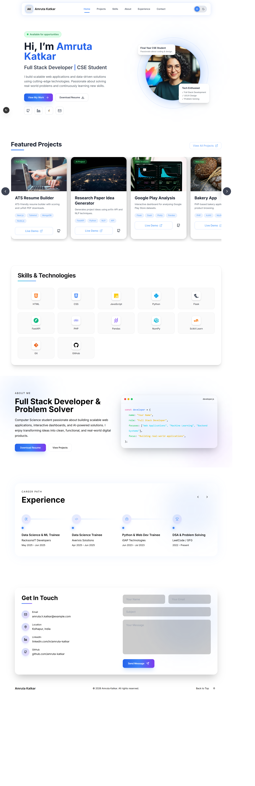

# 🌐 Personal Portfolio Website

A modern and responsive developer portfolio built using **Next.js**, **React.js**, and **Tailwind CSS**.

---

# 📸 Screenshots

## Page



---

## ✨ Features

- 🌙 Dark / Light Mode
- ⚡ Smooth Scrolling Navigation
- 📱 Fully Responsive
- 💼 Experience Timeline
- 📂 Featured Projects Section
- 🛠 Skills Showcase
- 📄 Resume Download Button

---

# 🛠 Tech Stack

| Technology | Usage |
|------------|-------|
| Next.js | Framework |
| React.js | Frontend |
| Tailwind CSS | Styling |
| Lucide React | Icons |

---

# 📂 Folder Structure

```bash
src/
│
├── app/
│   ├── page.js
│   └── globals.css
│
├── components/
│   ├── Navbar.jsx
│   ├── HeroSection.jsx
│   ├── AboutSection.jsx
│   ├── SkillsSection.jsx
│   ├── ProjectsSection.jsx
│   ├── ExperienceSection.jsx
│   └── ContactSection.jsx
```

---

# ⚙️ Installation

## 1️⃣ Clone Repository

```bash
git clone https://github.com/your-username/portfolio.git
```

## 2️⃣ Move into Project Folder

```bash
cd portfolio
```

## 3️⃣ Install Dependencies

```bash
npm install
```

## 4️⃣ Start Development Server

```bash
npm run dev
```

---

# 🌙 Dark Mode

Dark mode is implemented using:

- Tailwind CSS dark classes
- LocalStorage persistence
- React state management

---

#  Author

## Amruta Katkar

- Full Stack Developer
- CSE Student
- Passionate about Web Development & Data Science

---

# ⭐ Support

If you like this project:

-  Star the repository
-  Fork the project
-  Share with others

---
